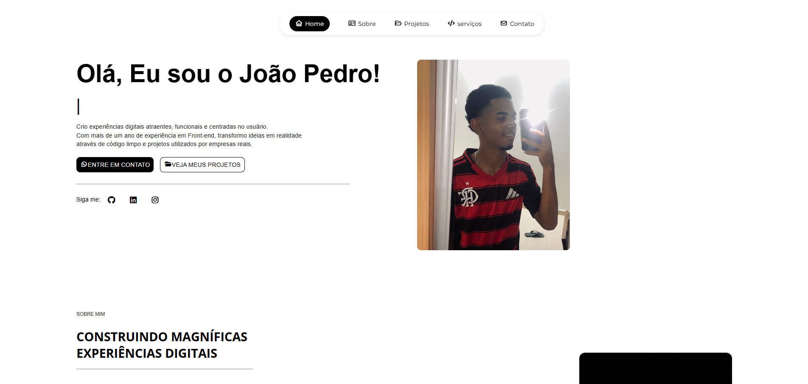

Bem-vindo ao repositório do meu portfólio pessoal! Este projeto foi desenvolvido para apresentar minhas habilidades, experiência e os projetos que desenvolvi ao longo da minha jornada como Desenvolvedor Front-End.


<p align="center">
  
</p>


## 🚀 Sobre o Projeto

Este é um site de portfólio totalmente responsivo e interativo. O objetivo é criar uma vitrine profissional que funcione perfeitamente em desktops, tablets e dispositivos móveis, oferecendo uma experiência de usuário (UX) fluida e moderna.

O site inclui seções para:
- **Home:** Apresentação inicial com animação de digitação.
- **Sobre Mim:** Resumo profissional e habilidades.
- **Projetos:** Galeria com os principais trabalhos e links para repositórios/demos.
- **Serviços:** Detalhamento do que ofereço (Web Development, UI/UX, etc.).
- **Contato:** Formulário visual e links para redes sociais.


## 🛠️ Tecnologias Utilizadas

O projeto foi construído utilizando tecnologias nativas e bibliotecas leves para garantir performance:

- **HTML5:** Estrutura semântica.
- **CSS3:**
  - Layouts Flexbox e Grid.
  - Animações (`keyframes`) e transições suaves.
  - Design Responsivo (Media Queries).
  - Variáveis e estilização moderna.
- **JavaScript (Vanilla):**
  - Menu Mobile (Hambúrguer).
  - Efeito de digitação ("Typing animation").
  - Scroll suave e revelação de elementos ao rolar a página.
  - Tela de carregamento (Loading Screen).
- **Bibliotecas:**
  - [Font Awesome](https://fontawesome.com/) (Ícones).
  - [Google Fonts](https://fonts.google.com/) (Tipografia).

## 📂 Projetos em Destaque

Alguns dos projetos listados neste portfólio incluem:

1.  **Site Hotel Ouro do Cerrado:** Interface moderna para hotelaria com foco em check-in.
2.  **Hamburgueria & Pizzaria:** Site responsivo com cardápio e animações.
3.  **Globosat Landing Page:** Página de vendas de serviços de internet.
4.  **Justly Advocacia:** Landing page corporativa para escritório de advocacia.

## ⚙️ Como Executar

Este é um projeto estático, o que significa que não requer instalação de dependências complexas.

1.  **Clone o repositório:**
    ```bash
    https://github.com/DEV-JOTAPE11/Portf-lio-atualizado.git
    ```
2.  **Abra o projeto:**
    Navegue até a pasta do projeto e abra o arquivo `index.html` em qualquer navegador moderno.

    *Dica: Se estiver usando o VS Code, você pode usar a extensão "Live Server" para ver as alterações em tempo real.*

## 📱 Responsividade

O layout adapta-se automaticamente a diferentes tamanhos de tela:
- **Desktop:** Menu horizontal completo e layout em grade.
- **Mobile:** Menu "Hambúrguer" lateral, elementos empilhados e otimizados para toque.

## 📬 Contato

Gostou do meu trabalho? Vamos conversar!

- **LinkedIn:** [João Pedro](https://www.linkedin.com/in/jo%C3%A3o-pedro-pires-queiroz-6a7a84386/)
- **GitHub:** [DEV-JOTAPE11](https://github.com/DEV-JOTAPE11)
- **Instagram:** [@jp.devsites](https://www.instagram.com/jp.devsites/)

---
Desenvolvido com 💙 por João Pedro.
